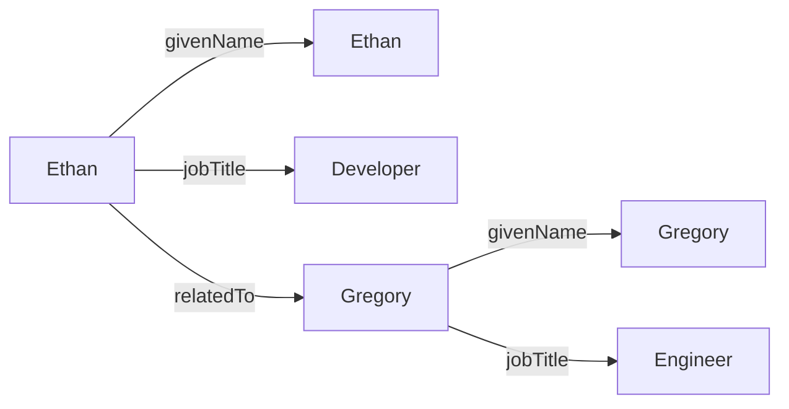

Worlds Platform is built on proven semantic web technologies, providing AI agents with structured memory and reasoning capabilities. This guide introduces the core concepts you need to understand to work effectively with Worlds.

## What is a World?

A **world** is a knowledge base that stores structured information as a graph of interconnected facts. Think of it as a persistent memory space for your AI agents or applications.

<Note>
  Each world is an isolated SPARQL-compatible knowledge base with its own:
  - RDF triple store
  - Vector embeddings for semantic search
  - Query and update history
  - Access controls
</Note>

Worlds are designed to be:

- **Persistent**: Knowledge survives across sessions and application restarts
- **Queryable**: Use SPARQL to reason over complex relationships
- **Searchable**: Combine symbolic queries with vector similarity search
- **Interoperable**: Based on W3C standards (RDF, SPARQL)

### World Structure

Each world has:

| Property | Description |
| --- | --- |
| `id` | Unique identifier (ULID) |
| `slug` | URL-friendly identifier |
| `label` | Human-readable name |
| `description` | Optional detailed description |
| `createdAt` / `updatedAt` | Timestamps |

## Knowledge Graphs and Triples

At the heart of Worlds Platform is the **knowledge graph** — a network of entities and their relationships.

### The Triple Model

All knowledge in a world is stored as **triples**: statements with three parts.

```
subject → predicate → object
```

Each triple represents a single fact. For example:

```turtle
<http://example.com/ethan> <http://schema.org/givenName> "Ethan" .
```

Breaking it down:

- **Subject**: `<http://example.com/ethan>` — the entity we're describing
- **Predicate**: `<http://schema.org/givenName>` — the property or relationship
- **Object**: `"Ethan"` — the value (can be a literal or another entity)

<Tip>
  URIs (like `http://example.com/ethan`) uniquely identify entities globally. This makes your knowledge base interoperable with other data sources.
</Tip>

### Building a Knowledge Graph

Multiple triples connect to form a graph:

```turtle
# Person entities
<http://example.com/ethan> <http://schema.org/givenName> "Ethan" .
<http://example.com/ethan> <http://schema.org/jobTitle> "Developer" .
<http://example.com/ethan> <http://schema.org/relatedTo> <http://example.com/gregory> .

<http://example.com/gregory> <http://schema.org/givenName> "Gregory" .
<http://example.com/gregory> <http://schema.org/jobTitle> "Engineer" .
```

This creates a graph with:
- Two people (Ethan and Gregory)
- Properties for each (names and job titles)
- A relationship between them

### Visualizing the Graph



## RDF Basics

**RDF (Resource Description Framework)** is the W3C standard for representing knowledge graphs. It provides:

- A standard way to encode triples
- Multiple serialization formats (Turtle, N-Triples, JSON-LD, etc.)
- Built-in support for data types and languages
- Global identifiers via URIs

<Note>
  You don't need to be an RDF expert to use Worlds Platform. The SDK handles most of the complexity for you. Just understand that your data is stored as triples.
</Note>

### Common RDF Vocabularies

Instead of inventing your own predicates, use standard vocabularies:

- **schema.org**: General purpose (people, places, events)
- **FOAF (Friend of a Friend)**: Social networks and people
- **Dublin Core**: Metadata (titles, creators, dates)
- **SKOS**: Taxonomies and classifications

Example using schema.org:

```turtle
<http://example.com/ethan> <http://schema.org/givenName> "Ethan" .
<http://example.com/ethan> <http://schema.org/email> "ethan@example.com" .
<http://example.com/ethan> <http://schema.org/knows> <http://example.com/gregory> .
```

## SPARQL Query Language

**SPARQL** is to knowledge graphs what SQL is to relational databases. It lets you query and update RDF data.

<Tip>
  SPARQL is a W3C standard with extensive documentation at [w3.org/TR/sparql11-overview](https://www.w3.org/TR/sparql11-overview/). Worlds Platform fully supports SPARQL 1.1.
</Tip>

### Basic SELECT Query

Find all people and their names:

```sparql
SELECT ?person ?name WHERE {
  ?person <http://schema.org/givenName> ?name .
}
```

The `?` prefix indicates a variable. This query finds all subjects with a `givenName` predicate.

### Filtering Results

Find people with specific job titles:

```sparql
SELECT ?person ?name WHERE {
  ?person <http://schema.org/givenName> ?name .
  ?person <http://schema.org/jobTitle> "Engineer" .
}
```

### Complex Graph Patterns

Find all colleagues of Ethan:

```sparql
SELECT ?colleague ?name WHERE {
  <http://example.com/ethan> <http://schema.org/relatedTo> ?colleague .
  ?colleague <http://schema.org/givenName> ?name .
  ?colleague <http://schema.org/jobTitle> ?title .
}
```

### INSERT and UPDATE

SPARQL isn't just for querying — you can modify data too:

```sparql
# Insert new triples
INSERT DATA {
  <http://example.com/alice> <http://schema.org/givenName> "Alice" .
  <http://example.com/alice> <http://schema.org/jobTitle> "Designer" .
}
```

```sparql
# Delete triples
DELETE DATA {
  <http://example.com/ethan> <http://schema.org/jobTitle> "Developer" .
}
```

```sparql
# Update (delete + insert)
DELETE {
  ?person <http://schema.org/jobTitle> ?oldTitle .
}
INSERT {
  ?person <http://schema.org/jobTitle> "Senior Engineer" .
}
WHERE {
  ?person <http://schema.org/givenName> "Gregory" .
  ?person <http://schema.org/jobTitle> ?oldTitle .
}
```

## Symbolic Memory vs. Traditional RAG

Worlds Platform focuses on **symbolic memory** rather than just retrieval-augmented generation (RAG).

<CardGroup cols={2}>
  <Card title="Traditional RAG" icon="search">
    - Similarity-based search
    - Returns relevant text chunks
    - No understanding of relationships
    - Limited reasoning capability
  </Card>
  <Card title="Worlds (Symbolic Memory)" icon="brain">
    - Graph-based reasoning
    - Understands relationships and hierarchies
    - Logical inference over structured data
    - Combines search with reasoning
  </Card>
</CardGroup>

### Example: Why Symbolic Memory Matters

Consider this question: "Who are Ethan's colleagues who are engineers?"

**Traditional RAG approach:**
1. Embed the question
2. Find similar text chunks
3. Hope the answer is in the retrieved text
4. Limited ability to reason about relationships

**Worlds Platform approach:**
1. Query the knowledge graph with SPARQL
2. Traverse relationships: Ethan → relatedTo → ?colleague
3. Filter by property: ?colleague → jobTitle → "Engineer"
4. Return precise, structured results

```sparql
SELECT ?name WHERE {
  <http://example.com/ethan> <http://schema.org/relatedTo> ?colleague .
  ?colleague <http://schema.org/givenName> ?name .
  ?colleague <http://schema.org/jobTitle> "Engineer" .
}
```

The symbolic approach gives you:
- **Precision**: Exact answers based on logical queries
- **Explainability**: Clear reasoning path
- **Composability**: Complex multi-hop reasoning
- **Consistency**: No hallucinations about relationships

<Note>
  Worlds Platform combines the best of both: Use SPARQL for precise symbolic reasoning, and vector search for semantic similarity when you need it.
</Note>

## The Worlds Advantage

By building on semantic web standards, Worlds Platform provides:

1. **True Reasoning**: Go beyond keyword matching to understand relationships and hierarchies
2. **Persistent Memory**: Knowledge persists across sessions, like a long-term memory for AI
3. **Interoperability**: Built on W3C standards used across the web
4. **Federated Queries**: Connect and query multiple knowledge sources
5. **AI-Native**: First-class support for LLM tool-calling and context injection

## Next Steps

<CardGroup cols={2}>
  <Card title="Quickstart" icon="rocket" href="/quickstart">
    Build your first world in 5 minutes
  </Card>
  <Card title="SPARQL Guide" icon="graduation-cap" href="/guides/sparql">
    Deep dive into SPARQL queries
  </Card>
  <Card title="API Reference" icon="book" href="/api/authentication">
    Explore the REST API endpoints
  </Card>
  <Card title="Research Papers" icon="file" href="https://arxiv.org/abs/2412.10654">
    Read about the science behind Worlds
  </Card>
</CardGroup>
